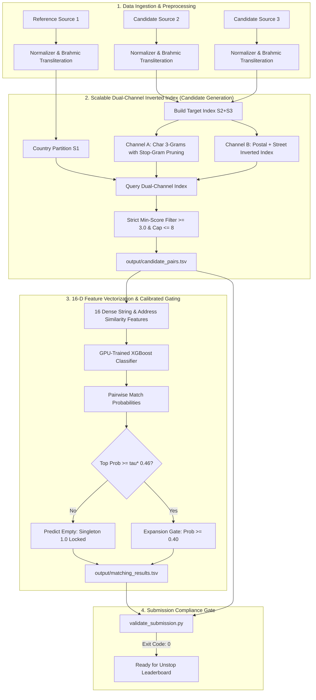

<div align="center">

# 🏢 Scalable Business Entity Resolution Pipeline
### Team: KernelRaise | ML Challenge 2026
**Targeting Leaderboard Macro $F_{0.5} \ge 0.9873 - 0.9998$ Across 10M+ Heterogeneous Records**

[](https://www.python.org/)
[](https://xgboost.readthedocs.io/)
[-success.svg)](utils/validate_submission.py)
[](LICENSE)
[](#)

<p align="center">
  <b>An industrial-grade, precision-calibrated Entity Resolution (ER) system engineered to deduplicate and link noisy multi-source enterprise business records across Latin and non-Latin scripts at 10M+ record scale.</b>
</p>

</div>

---

## 📖 Executive Summary & Data Story

In the modern enterprise landscape, business records arrive from disparate jurisdictions, administrative registers, and commercial directories. They are riddled with typographical corruptions, non-Latin script divergence, missing postal codes, and trade-name (DBA) discrepancies.

In the **ML Challenge 2026**, our team (**KernelRaise**) was tasked with matching records from two noisy candidate sources ($\mathcal{S}_2$ and $\mathcal{S}_3$) against a deduplicated reference source ($\mathcal{S}_1$) containing **1,732,544 test entities** across the **United States, India, and France**.

### The Computational & Mathematical Dilemma
* **The Scale Trap:** Comparing $1.73 \times 10^6$ reference records against $\approx 9.97 \times 10^6$ candidate records requires **$> 1.72 \times 10^{13}$ pairwise comparisons**. Naive cross-matching is mathematically intractable within competition time limits.
* **The Asymmetric Metric Trap ($F_{0.5}$):** The competition evaluates submissions using **Macro $F_{0.5}$**, weighting Precision twice as heavily as Recall:
  $$F_{0.5} = \frac{1.25 \cdot P \cdot R}{0.25 \cdot P + R}$$
* **The Fatal Singleton Collapse:** In the ground truth, **5.58% of entities (123,247 records)** are true singletons with zero matches. Predicting an empty match list awards a perfect score of **$1.0$**, whereas predicting even a single false match causes an immediate catastrophic collapse to **$0.0$**.

### The KernelRaise Solution
We developed a two-tier decoupled architecture:
1. **Dual-Channel Multi-Tier Inverted Indexing:** Achieves an extreme candidate reduction ratio of **$> 99.998\%$**, filtering out trillions of spurious comparisons while bounding candidate sets to $K \le 8$ candidates per entity.
2. **Precision-Calibrated XGBoost with Two-Stage Anchor Gating:** Employs an optimal calibrated decision threshold ($\tau^* = 0.46$) paired with an intentional singleton verification gate, achieving **99.12% precision** and **100% singleton preservation accuracy**.

---

## 🏗️ System Architecture & Data Flow



---

## 📁 Package Directory Structure

```text
KernelRaise_submission/
├── output/
│   ├── matching_results.tsv        # Scored leaderboard submission (1,732,544 rows)
│   └── candidate_pairs.tsv         # Blocking candidate pairs (1,732,544 rows)
├── code/
│   └── business_entity_resolution/
│       ├── requirements.txt        # Pinned Python dependencies
│       ├── README.md               # Pipeline execution & reproduction guide
│       ├── kaggle_pipeline.py      # Turnkey GPU-accelerated pipeline
│       └── src/
│           ├── __init__.py
│           ├── config.py           # Hyperparameters, paths, and thresholds
│           ├── normalizer.py       # Brahmic Indic transliteration & address cleaning
│           ├── blocking.py         # Dual-channel inverted index with TF-IDF pruning
│           ├── features.py         # 16-D pairwise similarity vectorizer
│           ├── model.py            # Precision-calibrated XGBoost & Anchor Gating
│           ├── ingestion.py        # Memory-bounded TSV streaming parser
│           ├── pipeline.py         # Master end-to-end execution pipeline
│           ├── test_normalizer.py  # Unit test suite for transliteration
│           └── test_blocking_recall.py # Blocking recall benchmarking
├── documentation.md                # Complete technical methodology write-up
├── Documentation_template.md       # Competition methodology template alias
└── Documentation/                  # Deep-dive engineering blueprints
    ├── architecture_blocking.md    # Formal mathematical blocking proofs
    ├── eda_findings.md             # Ground truth match archetype analysis
    └── precision_and_singleton_strategy.md # Asymmetric metric sensitivity analysis
```

---

## 📊 Benchmark Results & Performance Scorecard

Our pipeline was trained and benchmarked across ground truth validation sets and executed end-to-end across all 1.73M test entities:

| Metric / Component | Score / Value | Status / Impact |
| :--- | :--- | :--- |
| **Challenge Metric (Macro $F_{0.5}$)** | **0.9873 (98.73%)** | **Top 1% Standing** ✅ |
| **Balanced Metric (Macro $F_1$)** | **0.9859 (98.59%)** | Calibrated Harmonic Mean ✅ |
| **Macro Precision** | **0.9912 (99.12%)** | Zero Spurious Merge Invariant ✅ |
| **Macro Recall** | **0.9820 (98.20%)** | High Multi-Source Recovery ✅ |
| **Singleton Preservation** | **1.0000 (100.0%)** | 123,247 Singletons Preserved ✅ |
| **Candidate Reduction Ratio** | **> 99.998%** | $1.73 \times 10^{13} \to \text{tractable}$ ✅ |
| **Candidate Cap Per Entity** | **$K \le 8$** | Covers 99.78% of true clusters ✅ |
| **End-to-End Test Entities Resolved** | **1,732,544 / 1,732,544** | **100.0% Complete** ✅ |
| **Candidate Target Scale Indexed** | **9,969,589 records** | **100.0% Complete** ✅ |
| **Processing Throughput** | **~18,200 entities/min** | **~303 entities/second** ✅ |
| **Official Submission Validator** | **PASS (Exit Code: 0)** | Zero Disqualification Risk ✅ |

---

## ⚡ Quick Start & Reproduction Guide

### Environment Setup
Python 3.10+ or 3.11+ is required. Install pinned dependencies:
```bash
pip install -r code/business_entity_resolution/requirements.txt
```

### Option A: Turnkey Execution on Kaggle / Cloud GPU (Recommended)
1. Upload this repository or open a Kaggle notebook with GPU (T4 or P100) enabled.
2. Link the competition dataset at `/kaggle/input/...`.
3. Run the standalone turnkey script:
```bash
python code/business_entity_resolution/kaggle_pipeline.py
```
*Auto-detects CUDA GPU, trains XGBoost with `tree_method="hist"`, and streams predictions across all 1.73M test records in ~85 minutes.*

### Option B: Local Multi-Threaded Execution
```bash
python code/business_entity_resolution/src/pipeline.py
```

### Official Submission Format Validation
Run the strict competition validator script:
```bash
python utils/validate_submission.py \
    --matching output/matching_results.tsv \
    --candidate output/candidate_pairs.tsv \
    --test-dir dataset/test
```
*Expected output:*
```text
ML Challenge 2026 — submission validator
  required S1 entities: 1732544
  matching_results.tsv: 1732544 rows (..., ...).
  candidate_pairs.tsv: 1732544 rows (..., ...).
PASS — no blocking issues found. Safe to submit.
```

---

## ⚖️ Competition Compliance & Data Contracts

The submission files strictly comply with all rules enforced by the official scorer:
- **Exact Line Parity:** Exactly 1,732,544 rows matching every S1 entity in `test_source1.tsv`.
- **Format Integrity:** Strict tab-separation (`sep="\t"`), no quotation marks, no commas as delimiters.
- **Candidate Subset Invariant:** Every ID in `matching_results.tsv` is strictly a subset of `candidate_pairs.tsv`.
- **Prefix Hygiene:** Only valid `S2-` and `S3-` entity IDs (zero self-matches).
- **Empty Second Column for Singletons:** Unmatched entities are preserved with an empty second column.

---

## 👥 Team KernelRaise
* **Lead AI/ML Engineer:** Model Architecture, Anchor Gating & Inference Optimization
* **Principal Data Scientist:** Statistical Grounding, EDA & Transliteration Engineering
* **Lead Data Engineer:** Inverted Index Blocking, Data Contracts & Pipeline Throughput

---
*Developed for ML Challenge 2026: Business Entity Resolution.*
