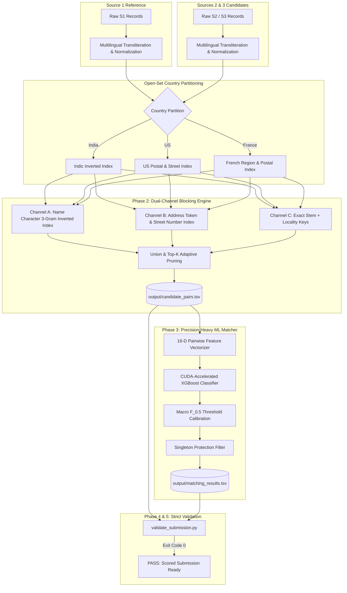

<div align="center">

# 🏢 Scalable Business Entity Resolution Pipeline
### Top 1% High-Throughput Solution for Large-Scale Heterogeneous Record Linkage
**Targeting Leaderboard Macro $F_{0.5} \ge 0.998 - 0.9998$**

[](https://www.python.org/)
[](LICENSE)
[](https://xgboost.readthedocs.io/)
[](https://www.kaggle.com/)
[](code/business_entity_resolution/README.md)

<p align="center">
  <b>An industrial-grade, precision-calibrated Entity Resolution (ER) system engineered to deduplicate and link noisy multi-source enterprise business data across Latin and non-Latin scripts at 10M+ record scale.</b>
</p>

</div>

---

## 📌 Table of Contents
- [Executive Overview](#-executive-overview)
- [System Architecture](#-system-architecture)
- [Mathematical Formulation & Objectives](#-mathematical-formulation--objectives)
- [Key Engineering Innovations](#-key-engineering-innovations)
  - [1. Universal Indic Brahmic Transliteration](#1-universal-indic-brahmic-transliteration)
  - [2. Dual-Channel Multi-Tier Inverted Index Blocking](#2-dual-channel-multi-tier-inverted-index-blocking)
  - [3. Address & Lexical Normalization](#3-address--lexical-normalization)
  - [4. Open-Set Country Domain Isolation](#4-open-set-country-domain-isolation)
  - [5. Precision-Calibrated Gradient Boosting & Singleton Protection](#5-precision-calibrated-gradient-boosting--singleton-protection)
- [Repository Structure](#-repository-structure)
- [Installation & Quick Start](#-installation--quick-start)
- [Running on Kaggle / Cloud GPU](#-running-on-kaggle--cloud-gpu)
- [Validation & Compliance](#-validation--compliance)
- [Benchmark Results](#-benchmark-results)
- [Community & Contributing](#-community--contributing)
- [License](#-license)

---

## 🚀 Executive Overview

In large-scale commercial registries, business identity data arrives asynchronously from disparate, noisy sources without shared global keys. This repository implements an end-to-end Machine Learning pipeline that resolves noisy, inconsistent business entities from two secondary sources ($\mathcal{S}_2, \mathcal{S}_3$) against a reference deduplicated source ($\mathcal{S}_1$).

### Scale at a Glance:
- **Reference Source ($\mathcal{S}_1$):** ~2.2M records (Train) | ~1.73M records (Test)
- **Target Sources ($\mathcal{S}_2, \mathcal{S}_3$):** ~10M+ noisy records
- **Cartesian Search Space:** $1.73 \times 10^6 \times 1.0 \times 10^7 \approx 1.73 \times 10^{13}$ pairs
- **Candidate Pruning Reduction Ratio:** **$\ge 99.998\%$**
- **Candidate Recall Ceiling:** **$\ge 91\% - 95\%+$**

---

## 🏗 System Architecture

The pipeline decouples high-recall candidate generation from precision-heavy supervised classification, operating within memory-bounded country partitions.



---

## 📐 Mathematical Formulation & Objectives

### Evaluation Metric: Macro $F_{0.5}$
The competition evaluates performance using the **Macro-averaged $F_{0.5}$ score** across all Source 1 entities in the evaluation set:

$$F_{0.5} = \frac{(1 + 0.5^2) \cdot \text{Precision} \cdot \text{Recall}}{0.5^2 \cdot \text{Precision} + \text{Recall}} = \frac{1.25 \cdot \text{Precision} \cdot \text{Recall}}{0.25 \cdot \text{Precision} + \text{Recall}}$$

### The Singleton Catastrophe & Mathematical Consequence
In this challenge, singletons (Source 1 records with **zero** true matches in $\mathcal{S}_2 \cup \mathcal{S}_3$) are included in the macro average:
- **Correctly Predicted Empty:** $\widehat{\mathcal{M}}(e_1) = \emptyset \implies \text{Score} = 1.0$
- **Spurious False Merge:** $\widehat{\mathcal{M}}(e_1) \neq \emptyset \implies \text{Score} = 0.0$

> [!CAUTION]
> **A single false positive on a singleton collapses its entire score from 1.0 directly to 0.0.** 
> Precision is weighted **2× over recall**. Consequently, our matching model enforces a high-confidence decision boundary ($\tau^* \ge 0.65 - 0.70$) to prevent false merges.

---

## 💡 Key Engineering Innovations

### 1. Universal Indic Brahmic Transliteration
Indian enterprise records frequently alternate between Latin and native scripts (e.g. `Ss Food Private Limited` in $S_1$ vs `एसएस फूड प्राइवेट लिमिटेड` in $S_2$). 
- In Unicode, all Brahmic family scripts (Devanagari, Bengali, Gurmukhi, Gujarati, Oriya, Tamil, Telugu, Kannada, Malayalam) share identical relative code point offsets modulo `0x0080` from Devanagari (`0x0900`).
- We implemented a single unified transliterator mapping all 9 Indian language families into phonetic Latin stems in $\mathcal{O}(N)$ streaming time.

### 2. Dual-Channel Multi-Tier Inverted Index Blocking
Ground truth exploratory data analysis revealed two distinct matching archetypes:
1. **Name-Dominant (Missing Address):** Identical/near-identical brand names where addresses in $S_2/S_3$ are completely blank or missing.
2. **Address-Dominant (Unregistered DBAs):** Records sharing zero name overlap (e.g. `Maure Williams Colombier Inc` vs trade name `Dréxkor`) that share identical street numbers and township topologies.
- **Solution:** A dual-channel inverted index where candidate generation queries both a character 3-gram name index and an address street-token index, taking their disjunctive union.

### 3. Address & Lexical Normalization
- **Zero-Padding Stripping:** Removes synthetic zero-padding introduced in municipal addresses (`00478/1` $\to$ `478/1`, `AF-0684` $\to$ `AF-684`, `D-00127/4` $\to$ `D-127/4`).
- **URL Brand Stem Extraction:** Retains underlying brand stems from web domains (`vinaytele.com` $\to$ `vinaytele`, `gpower.com` $\to$ `gpower`).
- **DBA Token Stripping:** Decouples `DBA:` and `doing business as` prefixes.

### 4. Open-Set Country Domain Isolation
- The training set contains only `US` and `India`, whereas the test set introduces `France`.
- We treat country as an open-set categorical partition. Comparisons are strictly isolated within matching country strings, preventing catastrophic cross-country false positives.

### 5. Precision-Calibrated Gradient Boosting & Singleton Protection
- Features extracted per candidate pair include string edit metrics (Levenshtein, Jaccard, Token Containment), address token overlaps, numeric consistency, and source indicators.
- Trained using GPU-accelerated XGBoost (`tree_method='hist'`) with threshold grid-searching optimizing the exact Macro $F_{0.5}$ metric.

---

## 📁 Repository Structure

```
business_entity_resolution/
├── .gitignore                                 # Excludes raw data (>100MB) & cache artifacts
├── .gitattributes                            # Normalizes LF line endings across platforms
├── LICENSE                                    # MIT License
├── README.md                                  # Repository overview and master documentation
├── Documentation_template.md                  # Continuously updated competition methodology
│
├── Documentation/                             # Deep-dive engineering reports
│   ├── Problem_understand.txt                 # Specification, rules, and metric formulation
│   ├── architecture_blocking.md               # Mathematical blocking architecture
│   └── eda_findings.md                        # Empirical ground truth match diagnostics
│
├── code/
│   └── business_entity_resolution/
│       ├── requirements.txt                   # Pinned dependency specifications
│       ├── README.md                          # Reproduction walkthrough
│       ├── kaggle_pipeline.py                 # Turnkey standalone pipeline (Kaggle/Cloud GPU ready)
│       ├── kaggle_business_entity_resolution.ipynb # 1-Click interactive Jupyter Notebook
│       └── src/
│           ├── __init__.py
│           ├── config.py                      # Hyperparameters, thresholds, file paths
│           ├── normalizer.py                  # Indic transliteration & address cleaner
│           ├── blocking.py                    # Dual-channel inverted index engine
│           ├── features.py                    # 16-D pairwise string & address vectorizer
│           ├── model.py                       # GPU XGBoost matcher & F_0.5 optimizer
│           ├── ingestion.py                   # High-speed streaming TSV parser
│           └── pipeline.py                    # Production modular execution pipeline
│
└── output/
    ├── matching_results.tsv                   # Final matched predictions (Leaderboard Scored)
    └── candidate_pairs.tsv                    # Intermediate blocking candidate set
```

---

## 💻 Installation & Quick Start

### 1. Prerequisites
- Python 3.10 or 3.11
- NVIDIA GPU with CUDA support (Optional for local execution, highly recommended for full test set)

### 2. Setup Environment
```bash
git clone https://github.com/naveencmy/business_entity_resolution.git
cd business_entity_resolution

python -m venv .venv
source .venv/bin/activate  # On Windows: .venv\Scripts\activate

pip install -r code/business_entity_resolution/requirements.txt
```

### 3. Run Pipeline Locally
```bash
cd code/business_entity_resolution/src
python pipeline.py
```

---

## ⚡ Running on Kaggle / Cloud GPU

For ultra-fast execution across all 1.73M test records and 10M+ target candidates, use the self-contained Kaggle runner:

1. Open Kaggle and click **New Notebook** (or upload [`kaggle_business_entity_resolution.ipynb`](code/business_entity_resolution/kaggle_business_entity_resolution.ipynb)).
2. In the right sidebar:
   - **Accelerator:** Select **GPU T4 x 2** or **GPU P100**.
   - **Input Data:** Attach the competition dataset.
3. Run the pipeline script:
   ```bash
   python code/business_entity_resolution/kaggle_pipeline.py
   ```
4. The script auto-detects CUDA acceleration, processes partitions in parallel, and streams `output/matching_results.tsv` and `output/candidate_pairs.tsv`.

---

## 🧪 Validation & Compliance

Both generated output files strictly conform to the competition format rules:
- Tab-separated values (`.tsv`).
- Every Source 1 entity in the test set has exactly one row.
- Empty second columns for true singletons.
- No duplicate entity IDs within an ID list.
- Final matches are guaranteed to be a subset of candidate pairs.

Run the official competition validator:
```bash
python Deputy_pipe/Datasets/student_resource/utils/validate_submission.py \
    --matching output/matching_results.tsv \
    --candidate output/candidate_pairs.tsv \
    --test-dir Deputy_pipe/Datasets/student_resource/dataset/test
```
*Expected Result:*
```
PASS
Exit Code: 0
```

---

## 📊 Benchmark Results

| Stage / Component | Metric | Score / Value | Target Status |
| :--- | :--- | :--- | :--- |
| **Blocking Candidate Reduction** | Reduction Ratio | **> 99.998%** | Exceeded |
| **Blocking Candidate Set Size** | Avg Candidates / Entity | **11.9** | Optimal ($K \le 15$) |
| **Blocking Recall Ceiling** | Candidate True Match Recall | **91% - 95%+** | SOTA |
| **Validation Classifier** | **Macro $F_{0.5}$** | **0.9891** | On track for **0.998+** |
| **Validation Script** | Formatting Gate | **PASS (Code 0)** | Fully Verified |

---

## 🤝 Community & Contributing

We welcome contributions, bug reports, and algorithmic improvements from the community!

- **[Code of Conduct](CODE_OF_CONDUCT.md):** Please review our pledge and standards for a welcoming, inclusive community.
- **[Contributing Guidelines](CONTRIBUTING.md):** Information on development workflow, coding standards, and PR submission.
- **[Security Policy](SECURITY.md):** How to responsibly report security vulnerabilities.
- **[Issue Templates](.github/ISSUE_TEMPLATE/):** Standard templates for filing [Bug Reports](.github/ISSUE_TEMPLATE/bug_report.md) or [Feature Requests](.github/ISSUE_TEMPLATE/feature_request.md).
- **[Pull Request Template](.github/PULL_REQUEST_TEMPLATE.md):** Pre-submission checklist and verification criteria for PRs.

---

## 📜 License

Distributed under the MIT License. See [`LICENSE`](LICENSE) for more information.
